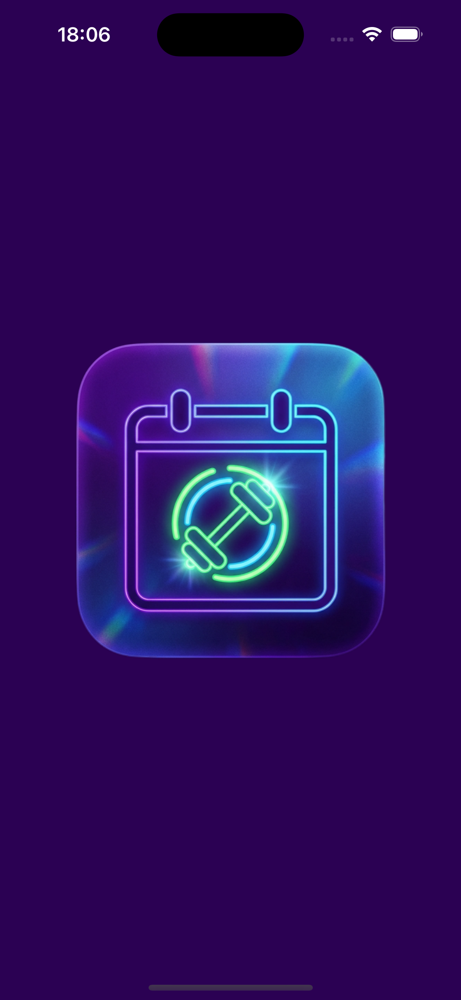
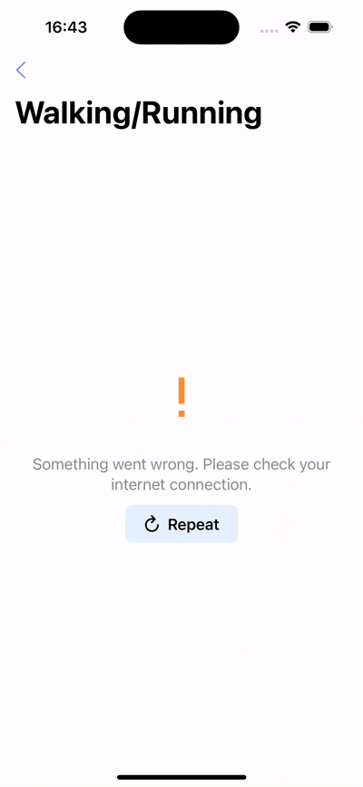

<p align="right"><b>English</b> | <a href="./README_RU.md">Русский</a></p>

#  Workout Calendar

<p align="left">
  
  
  
  
  
  
  
  
  
</p>

A modern workout tracking calendar for iOS, built with **SwiftUI** and the **MVVM+C** (Model-View-ViewModel + Coordinator) architectural pattern. The application provides a comprehensive calendar interface for viewing and managing workout sessions, featuring detailed statistics and interactive charts powered by **Swift Charts**. It uses modern **Structured Concurrency** with async/await and is enhanced with smooth **Lottie** animations.

## ✨ Features

- **📅 Calendar Interface:** An intuitive calendar view for navigating through months and selecting dates with marked workout days.
- **🏋️ Workout List:** View all workouts for a selected date with detailed information about activity type and timing.
- **📊 Interactive Charts:** Beautiful heart rate and speed charts built with **Swift Charts**, featuring smooth Catmull-Rom interpolation.
- **📋 Detailed Statistics:** View comprehensive workout metadata including distance, duration, temperature, and humidity.
- **🎨 Modern UI:** A clean, responsive interface enhanced with smooth **Lottie** animations for loading and error states.
- **🔄 Structured Concurrency:** Built with modern Swift concurrency using async/await and actors for thread-safe data handling.
- **🧪 Unit Testing:** Comprehensive test coverage using **Swift Testing** framework with Given-When-Then structure.
- **🛡️ Robust Error Handling:** Comprehensive error handling with user-friendly retry functionality.

## 🖼️ Preview

<div align="center">

| Launch Screen (iOS 17.5) | Main Flow (iOS 17.5) | Error State (iOS 17.5) |
|:---:|:---:|:---:|
|  |  |  |

</div>

## 🛠️ Technologies & Architecture

The project is built using the **MVVM+C (Model-View-ViewModel + Coordinator)** architectural pattern to ensure separation of concerns, testability, and clean navigation.

### ⚙️ Core Technologies

- **SwiftUI:** For building a declarative and responsive user interface.
- **Swift Charts:** For rendering interactive and beautiful workout data visualizations.
- **Structured Concurrency:** Using async/await, actors, and @MainActor for safe concurrent code.
- **Observation Framework:** Using @Observable macro for reactive state management.
- **Coordinator Pattern:** For managing navigation flow and decoupling views from navigation logic.

### 📦 Dependencies (SPM)

- **[Lottie](https://github.com/airbnb/lottie-spm):** For rendering high-quality vector animations.
- **[SwiftfulLoadingIndicators](https://github.com/SwiftfulThinking/SwiftfulLoadingIndicators):** For beautiful loading indicators.

### 🧪 Testing

- **Swift Testing:** Modern testing framework with @Test macro and #expect assertions.
- **Protocol-based Mocking:** NetworkServiceProtocol for easy dependency injection and testing.

### 📏 Code Standards

- **Conventional Commits:** All commits follow the [Conventional Commits](https://www.conventionalcommits.org/) specification.
- **Swift 6 Ready:** Using Swift Approachable Concurrency and strict actor isolation.

## 📁 Project Structure

```text
WorkoutCalendar/
├── API/                           # JSON data files
│   ├── diagram_data.json
│   ├── list_workouts.json
│   └── metadata.json
├── App/
│   ├── WorkoutCalendarApp.swift   # App entry point
│   └── Coordinator.swift          # Navigation coordinator
├── Helpers/
│   ├── Constants.swift            # App constants
│   ├── Data+Ext.swift             # Date extensions
│   ├── Font+Ext.swift             # Font extensions
│   └── String+Ext.swift           # String extensions
├── Models/
│   ├── Workout.swift              # Core workout model
│   ├── WorkoutDiagram.swift       # Chart data model
│   ├── WorkoutMetadata.swift      # Workout statistics
│   ├── WorkoutPoint.swift         # Data point for charts
│   ├── Mocks/                     # Mock data for previews
│   └── Network/                   # Network response DTOs
├── Services/
│   ├── NetworkServiceProtocol.swift
│   └── MockDataService.swift
├── ViewModels/
│   ├── CalendarViewModel.swift    # Calendar screen logic
│   └── WorkoutDetailViewModel.swift
├── Views/
│   ├── Calendar/                  # Calendar screen views
│   ├── Detail/                    # Workout detail views
│   └── Components/                # Reusable UI components
│       └── Lottie/                # Lottie animation views
└── Resources/                     # Assets and Info.plist
```

## 🚀 Installation

This project uses **Swift Package Manager** for dependency management.

1. **Clone the repository:**

   ```bash
   git clone https://github.com/teenagelove/WorkoutCalendar.git
   cd WorkoutCalendar
   ```

2. **Open the Project:**

   ```bash
   open WorkoutCalendar.xcodeproj
   ```

3. **Build and Run:**

   Select a simulator or device and press `Cmd + R` to build and run the project.

## 🧪 Running Tests

To run the unit tests:

```bash
# Using Xcode
Cmd + U

# Using command line
xcodebuild test -project WorkoutCalendar.xcodeproj -scheme WorkoutCalendar -destination 'platform=iOS Simulator,name=iPhone 15'
```

## 👥 Contributors

- [Danil Kazakov](https://github.com/teenagelove) - Creator and maintainer

## 📄 License

This project is available under the MIT license. See the [LICENSE](LICENSE) file for more info.
